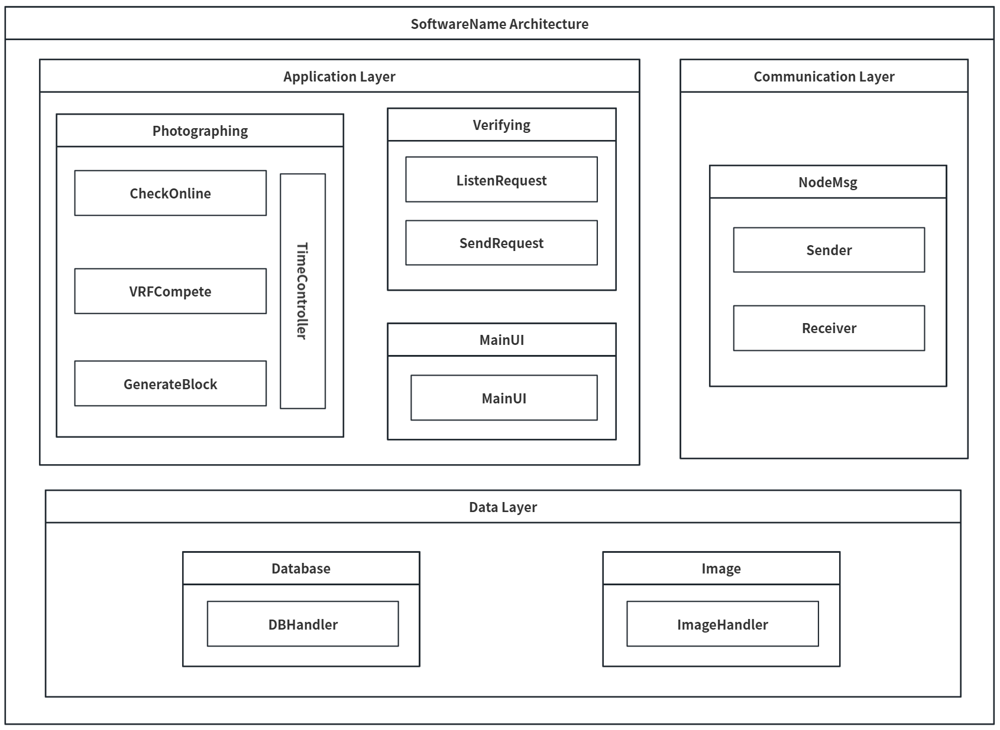

# ImageVerify: A Blockchain-Based Multimedia Verification System (BMVS)

This repository provides the source code and usage instructions for **ImageVerify**, an Android application leveraging blockchain technology to capture and verify the authenticity of digital images.

---

## 🔧 System Architecture



The system comprises six primary modules:

- **Image**: Captures images via the device camera and packages the original image along with the corresponding blockchain data into a ZIP archive.
- **Main UI**: Manages block creation, ensures data integrity, and handles data storage.
- **Photographing**: Processes incoming ZIP packages by extracting contents and verifying the authenticity of images through blockchain validation.
- **Verifying**: *(Description needed)*
- **NodeMessage**: *(Description needed)*
- **Database**: *(Description needed)*

---

## ✨ Features

- Capture images directly within the app, generating JPEG files.
- Package images and blockchain metadata into ZIP archives.
- Authenticate images through blockchain-based verification.
- Generate concise verification reports.

---

## 🖥 Requirements

- **Operating System**: Android 9.0 or later (tested on Android 10)
- **Programming Language**: Java (Android SDK)
- **Minimum SDK Version**: API Level 28

---

## 📦 Installation

1. Clone the repository:

   ```bash
   git clone https://github.com/your-username/imageverify.git
   cd imageverify
